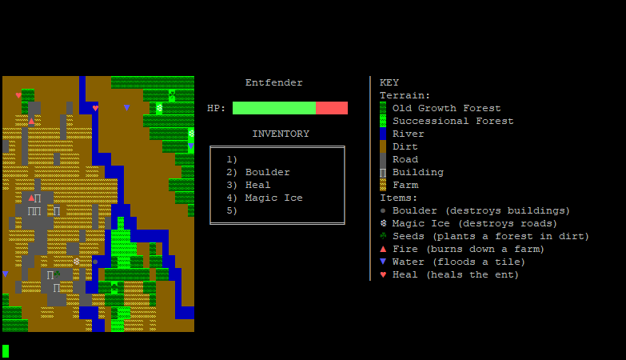

# entfender

A simple game demonstrating pointer use and dynamic memory allocation. A grid/tile-based "map" is represented by a 2D array of dynamically allocated tiles which parallels a four-way linked list. This allows for item use to iterate their effects through nearby tiles.

Runs on a Linux terminal for color/special character support.

